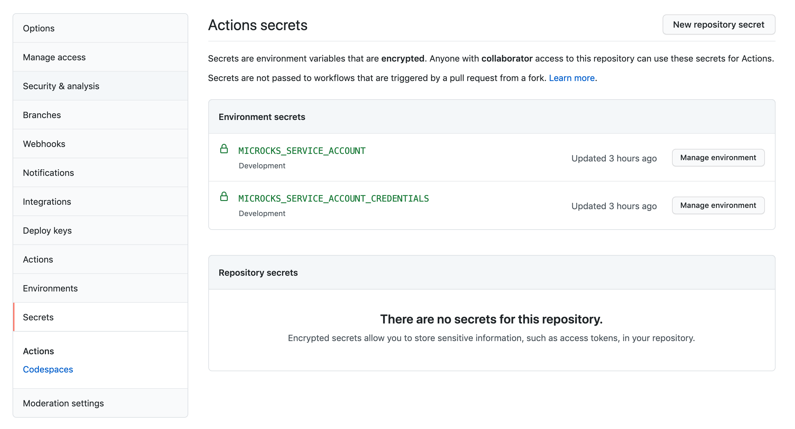

## GitHub Action for launching a Microcks test
### What is it?

This is a GitHub Action you may use in your Workflow to launch a Microcks test on a deployed API endpoint. If test succeeds (ie. API endpoint is compliant with API contract in Microcks) the workflow is pursuing, if not it fails. This action is basically a wrapper around the [Microcks CLI](https://github.com/microcks/microcks-cli) and provides the same configuration capabilities.

The `test` command of the CLI needs 3 arguments:

* `<apiName:apiVersion>` : Service to test reference. Exemple: `'Beer Catalog API:0.9'`
* `<testEndpoint>` : URL where is deployed implementation to test
* `<runner>` : Test strategy (one of: `HTTP`, `SOAP`, `SOAP_UI`, `POSTMAN`, `OPEN_API_SCHEMA`, `ASYNC_API_SCHEMA`, `GRPC_PROTOBUF`, `GRAPHQL_SCHEMA`))

With a bunch of mandatory flags:

* `--microcksURL` for the Microcks API endpoint,
* `--keycloakClientId` for the Keycloak Realm Service Account ClientId,
* `--keycloakClientSecret` for the Keycloak Realm Service Account ClientSecret.

And some optional ones:

* `--waitFor` for the time to wait for test to finish (int + one of: milli, sec, min). Default is `5sec`,
* `--secretName='<Secret Name>'` is an optional flag specifying the name of a Secret to use for connecting endpoint,
* `--operationsHeaders=<JSON>` allows to override some operations headers for the tests to launch.

### How to use it?

Obviously we can find this action with [GitHub Actions Marketplace](https://github.com/marketplace?type=actions) :wink:

You may add the Action to your Workflow directly from the GitHub UI.


#### Step 1 - Configure the GitHub action

```yaml
name: my-workflow
on: [push]
jobs:
  my-job:
    runs-on: ubuntu-latest
    environment: Development
    steps:
      - uses: microcks/test-github-action@v1
        with:
          apiNameAndVersion: 'API Pastry - 2.0:2.0.0'
          testEndpoint: 'http://my-api-pastry.apps.cluster.example.com'
          runner: OPEN_API_SCHEMA
          microcksURL: 'https://microcks.apps.acme.com/api/'
          keycloakClientId:  ${{ secrets.MICROCKS_SERVICE_ACCOUNT }}
          keycloakClientSecret:  ${{ secrets.MICROCKS_SERVICE_ACCOUNT_CREDENTIALS }}
          waitFor: '10sec'
```

#### Step 2 - Configure the Secrets

As you probably saw just above, we do think it's a best practice to use GitHub Secrets (general or tied to `Environment` like in the example) to hold the Keycloak credentials (client Id and Secret). See below the Secrets configuration we've used for the example:


